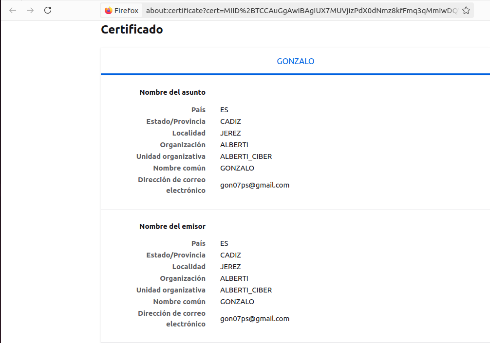
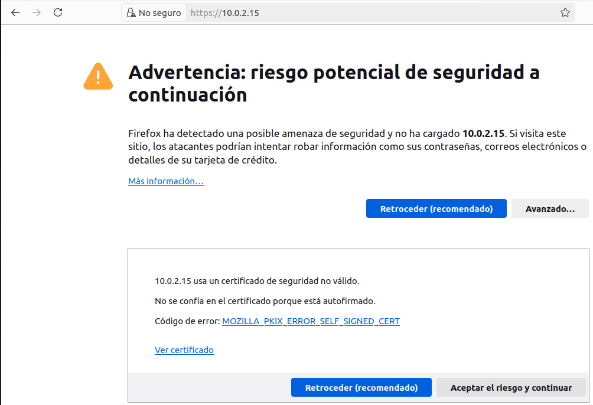
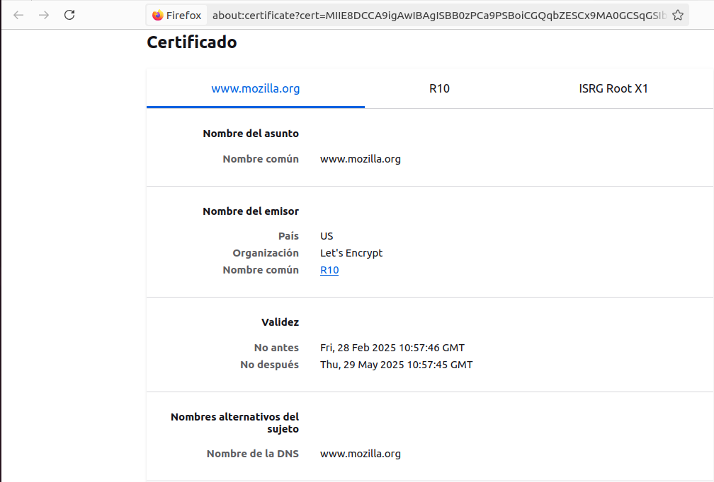

# Comparativa entre Certificado Autofirmado y Certificado Verificado

## 1. Introducción
Vamos a realizar una comparativa para ver las diferencias entre un **certificado autofirmado** y un **certificado verificado**.

---

## 2. Datos del Certificado Autofirmado

**País:** `ES`

**Estado/Provincia:** `CADIZ`

**Localidad:** `JEREZ`

**Organización:** `ALBERTI`

**Unidad organizativa:** `ALBERTI_CIBER`

**Nombre común:** `GONZALO`

**Dirección de correo electrónico:** `gon07ps@gmail.com`

### Advertencia del navegador

Como podemos observar, el navegador lanza una advertencia porque **el certificado no esta firmado por una entidad de confianza**, por lo tanto, cualquiera podria haberlo generado. Para acceder al sitio deberiamos aceptarlo manualmente.

## 3. Datos del Certificado Verificado

**Nombre comun** `www.mozilla.org`  

**País** `US`  

**Organización** `Let's Encrypt`  

**Nombre común** `R10`  

**No antes (Validez)** `Fri, 28 Feb 2025 10:57:46 GMT`

**No después (Validez)** `Thu, 29 May 2025 10:57:45 GMT`

**Nombre de la DNS** `www.mozilla.org`  

## 4. Comparación

| Característica              | Certificado Autofirmado       | Certificado Verificado       |
|------------------------------|--------------------------------|--------------------------------|
| **Emisor**                   | Generado manualmente          | Autoridad certificadora (CA)  |
| **Cadena de confianza**       | No confiable por defecto      | Reconocido por los navegadores |
| **Seguridad percibida**       | Advertencia en el navegador  | Sin advertencias              |
| **Costo**                     | Gratis                        | Puede ser gratuito o de pago  |
| **Uso recomendado**           | Desarrollo / interno          | Producción / sitios públicos  |

---

## 5. Conclusiones

En conclusion, podemos observar que los **certificados autofirmados** son utiles en entornos de desarrollo o redes privadas porque permiten cifrar las comunicaciones sin depender de una autoridad certificadora externa. Lo malo, es que no son adecuados para sitios publicos porque el navegador muestra una advertencia de seguridad al usuario, lo que puede generar desconfianza al usuario.

Por otro lado, los **certificados verificados**, nos ofrecen un nivel de confianza superior al estar firmados por una autoridad certificadora reconocida. Esto nos asegura que la conexión es segura y que la identidad del servidor ha sido validada. Tambien, protegen contra ataques de intermediario (MITM), asegurando que la información intercambiada entre el cliente y el servidor no pueda ser interceptada o modificada.

Para entornos de producción, se recomienda utilizar certificados emitidos por autoridades certificadoras confiables. Una opción gratuita es Let’s Encrypt, que permite obtener certificados válidos sin coste alguno. Tamien, se pueden obtener certificados de pago que ofrecen características adicionales, como validación extendida y mayor tiempo de vigencia.