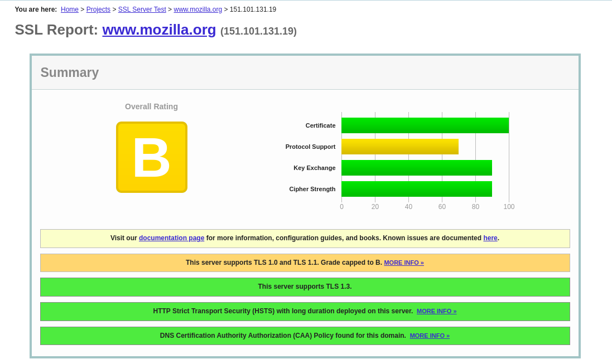
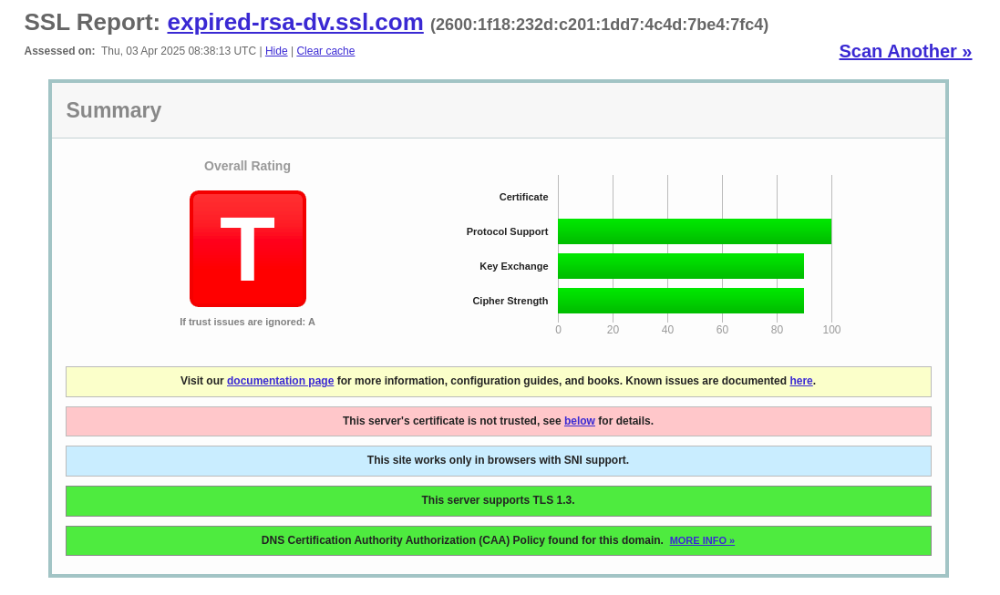
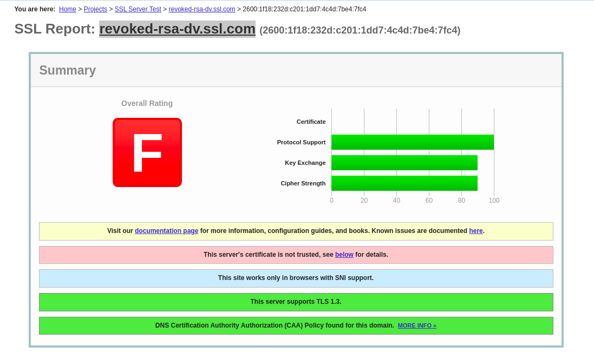

# Analisis de sitio web con certificado verificado y certificados erroneos

## 1. Analisis del sitio web con certificado verificado

Lo primero que vemos al analizar el sitio web en **SSL Labs**, es que tiene una calificacion general **B**.

Nos dan informacion sobre que el sitio web admite **TSL 1.3** (Transport Layer Security).

Tambien, tiene **HSTS** (Strict Transport Security) implementado en el servidor.

Por ultimo, vemos que el dominio cuenta con **CAA**(Certification Authority Authorization).

Este sitio web usa algoritmo **RSA 2048 bits (SHA256withRSA)**.

La fecha de expiración del certificado no ha pasado y está dentro del período válido.

Análisis de Certificados SSL/TLS

## 1. Análisis del Sitio Web con Certificado Verificado

Vamos a analizar un sitio web con certificado verificado (**www.mozilla.org**), utilizando la herramienta SSL Labs.

### - Calificación General

El análisis realizado en SSL Labsobservamos que el sitio web ha recibido una calificación B. Esto nos indica que, su configuración es adecuada y cumple con los estándares de seguridad, pero existen algunos aspectos que podrían mejorarse para alcanzar una mejor calificación.

### - Protocolos de Seguridad Soportados

El servidor admite el protocolo TLS 1.3 (Transport Layer Security 1.3), que es la versión más reciente y segura de TLS. Este protocolo ofrece mejoras en el rendimiento y en la seguridad en comparación con versiones anteriores, mitigando ataques como BEAST o POODLE, presentes en versiones más antiguas.

### - Implementación de HSTS

El sitio web tiene implementado HSTS (HTTP Strict Transport Security), una política de seguridad que obliga a los navegadores a conectarse exclusivamente a través de HTTPS. Esto previene ataques de tipo downgrade o intermediario (MITM), asegurando que las conexiones sean siempre cifradas.

### - Uso de CAA (Certification Authority Authorization)

Se detectó que el dominio cuenta con registros CAA (Certification Authority Authorization), lo que significa que el propietario del dominio ha definido qué autoridades certificadoras pueden emitir certificados para ese dominio. Esto ayuda a prevenir la emisión de certificados fraudulentos por parte de entidades no autorizadas.

### - Algoritmo de Firma Utilizado

El certificado usa el algoritmo RSA 2048 bits (SHA256withRSA). Este nivel de cifrado garantiza que la clave pública del certificado tenga una protección adecuada contra ataques de fuerza bruta.

### - Validez del Certificado

El certificado es válido y no ha expirado, lo que confirma que el administrador del sitio web ha renovado correctamente el certificado dentro del período de validez establecido por la autoridad certificadora.

## 2. Analisis de sitios con certificado erroneo

### - Certificado caducado.

**https://expired-rsa-dv.ssl.com**

Este sitio web nos lanza una advertencia de tipo: **ERR_CERT_DATE_INVALID**

El sitio web no es confiable por las siguientes razones.

- Su fecha de validez ha caducado.
- No cuenta con certificado de transparencia.
- No es confiable 

Por estas razones su calificacion general es T.

### - Certificado revocado.

**https://revoked-rsa-dv.ssl.com**

Este sitio web no lanza ninguna advertencia pero no tiene buen rate de certificado.

El sitio web no es confiable por las siguientes razones.

- Este certificado ha sido invalidado.
- Tiene "Chain issues", esto puede ocurrir cuando el certificado no esta instalado en el servidor.

Por estas razones su calificacion general es F.

